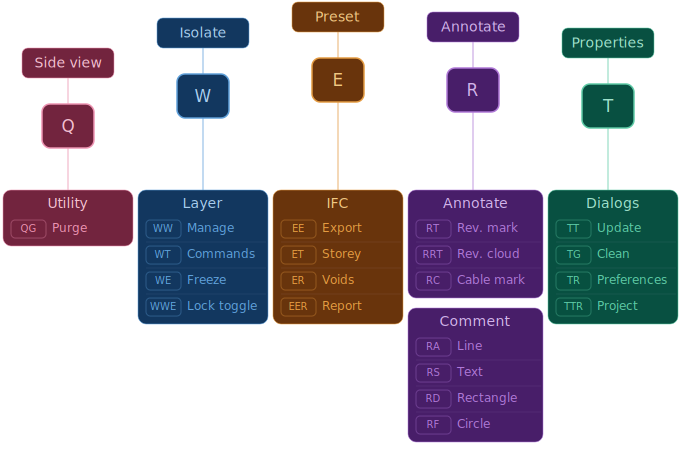
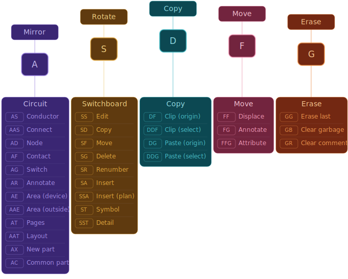
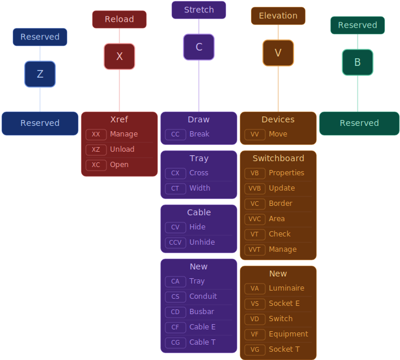
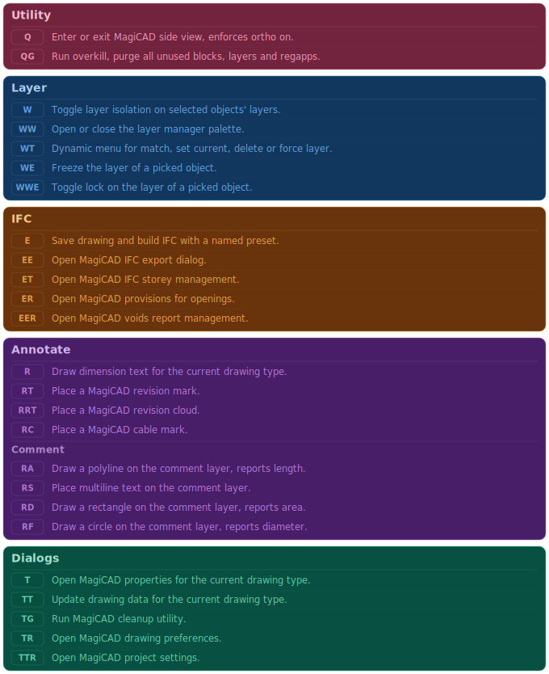
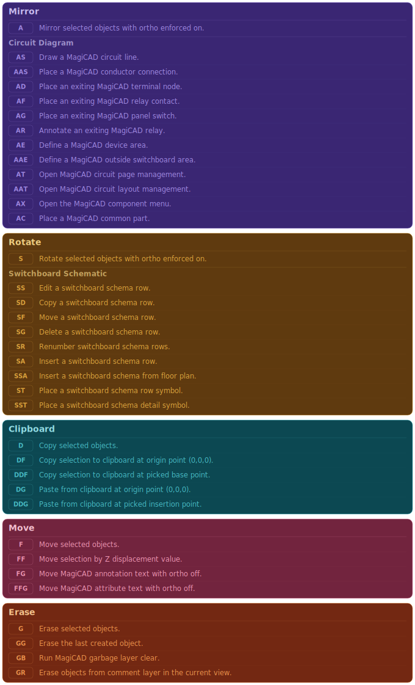
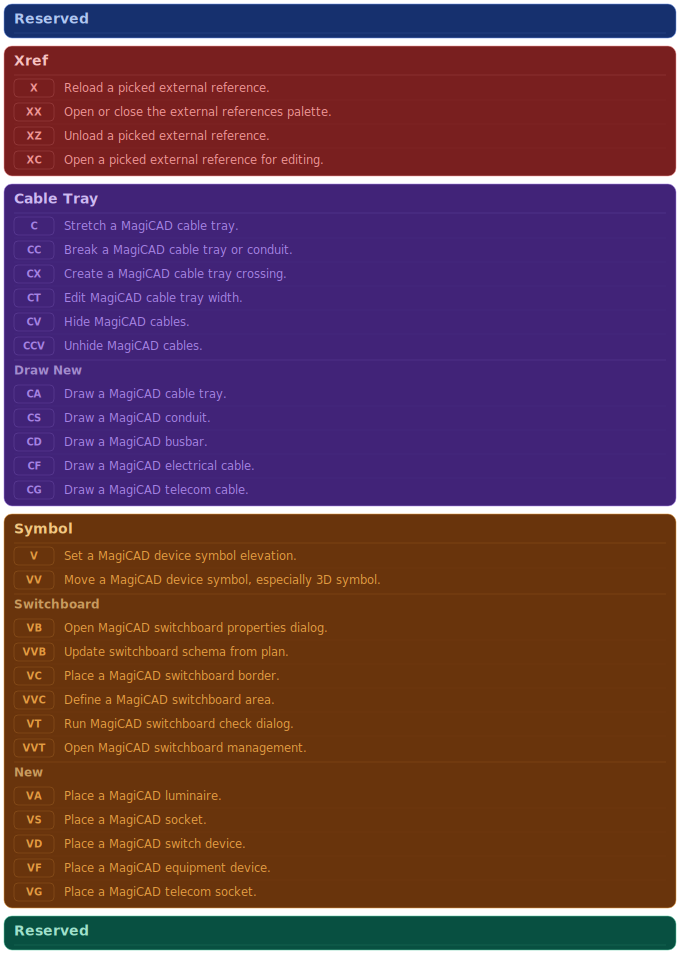

<h1 align="center">
  
</h1>

	<b><i>MagiCAD command shortcut suite for electrical design workflow.</i></b> 

  
  
  
  

## Table of Contents
[📝 General](#-general)
[🛠️ Installation](#️-installation)
[🎹 Mappings](#-mappings)
[⌨️ Commands](#️-commands)

## 📝 General

Custom AutoLISP command suite designed for daily drafting with MagiCAD. Current focus is in electrical design work but other disciplines are planned in future. All frequently used operations are mapped to short keyboard shortcuts organized by keyboard rows, eliminating the need for menus, ribbons, or toolbars.

## 🛠️ Installation

Download the repository as a `.zip` archive from GitHub and extract the `acaddoc.lsp`, `acad.pgp` and `src` folder into a dedicated directory.

Open AutoCAD and navigate to `Options` → `Files` tab. Expand **Support File Search Path** and add your folder to the **top** of the list. This ensures `acaddoc.lsp` and `acad.pgp` are loaded before any defaults.

In the same `Files` tab, expand **Trusted Locations** and add the same folder path. This prevents security prompts when loading the LISP files.

Restart AutoCAD. On first launch you may be prompted to allow the LISP files to load — select **Always Load** to avoid future prompts.

> [!NOTE]
> The `acaddoc.lsp` file runs automatically on every drawing open, loading all modules. The `acad.pgp` file registers the keyboard shortcuts on application launch. Both require the folder to be in **Support File Search Path** to take effect.

> [!TIP]
> Edit `globals.lsp` to configure variables used by the suite like **layer names** and **unit scaling**.

## 🎹 Mappings

Shortcuts are organized across three keyboard rows, each featuring five keys. Primary key triggers common action, with repeated or modified keys accessing related commands.

<h3 align="center">Top Row</h3>
 

  

 
<h3 align="center">Home Row</h3>
 

  

 
<h3 align="center">Bottom Row</h3>
 

  

## ⌨️ Commands

<h3 align="center">Top Row</h3>
 

  

 
<h3 align="center">Home Row</h3>
 

  

 
<h3 align="center">Bottom Row</h3>
 

  

