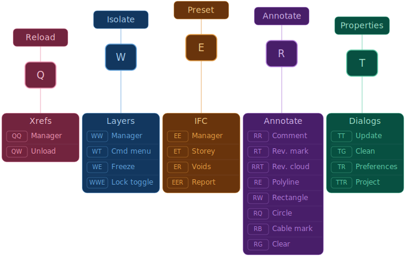
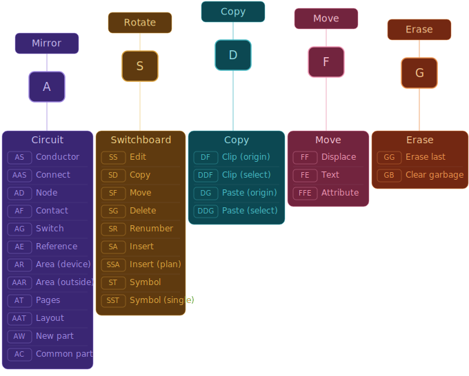

<h1 align="center">
  
</h1>

<p align="center">
	<b><i>AutoCAD LISP suite for electrical MEP design workflows.</i></b><br>
</p>

<p align="center">
  
  
  
  
</p>

<div align="center">

## Table of Contents
[📝 General](#-general)
[🛠️ Installation](#️-installation)
[⌨️ Commands](#️-commands)

</div>

## 📝 General

Custom AutoLISP command suite designed for daily electrical MEP drafting with MagiCAD. All frequently used operations are mapped to short keyboard shortcuts organized by keyboard row, eliminating the need for menus, ribbons, or toolbars.

The suite auto-detects drawing type (floor plan, switchboard schematic, or circuit diagram) and routes MagiCAD commands accordingly. Shared utilities handle state guards for system variables, UCS, layers, and error recovery.

## 🛠️ Installation

Download the repository as a `.zip` archive from GitHub and extract the files into a dedicated directory.

```
C:\CAD\LISP\
├── acaddoc.lsp
├── acad.pgp
├── globals.lsp
├── settings.lsp
├── utilities.lsp
├── cmd_magi.lsp
├── cmd_xref.lsp
├── cmd_layer.lsp
└── cmd_misc.lsp
```

Open AutoCAD and navigate to `Options` → `Files` tab. Expand **Support File Search Path** and add your folder to the **top** of the list. This ensures `acaddoc.lsp` and `acad.pgp` are loaded before any defaults.

In the same `Files` tab, expand **Trusted Locations** and add the same folder path. This prevents security prompts when loading the LISP files.

Restart AutoCAD. On first launch you may be prompted to allow the LISP files to load — select **Always Load** to avoid future prompts.

> [!NOTE]
> The `acaddoc.lsp` file runs automatically on every drawing open, loading all modules. The `acad.pgp` file registers the keyboard shortcuts on application launch. Both require the folder to be in `Support File Search Path` to take effect.

> [!TIP]
> Edit `globals.lsp` to configure layer names, comment text heights, drawing unit scale, and xref discipline layers for your project standards.

## ⌨️ Commands

Shortcuts are organized across three keyboard rows. Each primary key triggers the most common action, with repeated or modified keys accessing related commands.

### Top Row — Xref, Layer, Annotate, IFC, Voids & Dialogs

<p align="center">
  
</p>

### Home Row — Mirror, Rotate, Copy, Move & Erase

<p align="center">
  
</p>

### Bottom Row — Side View, Break, Stretch, Elevation & Devices

<p align="center">
  
</p>
